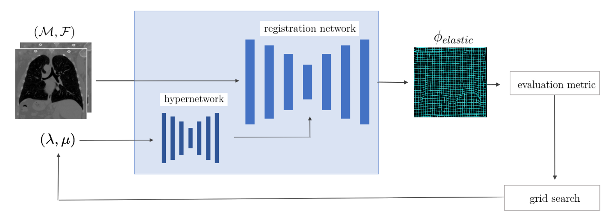

# elastic-regularization-hypermorph





Code for **"Learning Physics-Inspired Regularization for Medical Image Registration with Hypernetworks"**
*Anna Reithmeir, Julia A. Schnabel, Veronika A. Zimmer* — SPIE Medical Imaging 2024
**Finalist, Robert F. Wagner Best Student Paper Award**

[Paper (DOI)](https://doi.org/10.1117/12.3006539) · [arXiv](https://arxiv.org/abs/2311.08239)

**Keywords:** Linear Elasticity · Hypernetworks· Test-Time Adaptive Regularization

## Overview

Physics-inspired regularizers (e.g. linear-elastic, diffusion) are widely used in deformable medical image registration because they encourage anatomically plausible deformation fields. In practice, though, the physical parameters that control them (such as tissue elasticity) are usually fixed by hand and tuned per dataset. This repo implements a **hypernetwork-based approach** that learns to predict these regularization parameters directly from data, removing the need for manual tuning and retraining when the desired regularization strength changes.

The method builds on [HyperMorph](https://arxiv.org/abs/2101.01035) (Hoopes et al., IPMI 2021), extending it to elastic and diffusion regularizers whose weight is predicted by a hypernetwork conditioned on the image pair.

## Repository contents

| File | Description |
|---|---|
| `train_hypermorph_elastic.py` | Trains the hypernetwork with a learned elastic regularization weight |
| `train_hypermorph_elastic_fixed_constants.py` | Trains with a fixed (non-learned) elastic regularization weight, for comparison |
| `train_hypermorph_diffusion.py` | Trains the hypernetwork with a learned diffusion regularization weight |
| `regularizers.py` | Implementations of the elastic and diffusion regularizers |
| `datasets.py` | Dataloaders for the registration datasets used in the paper |
| `eval_metrics.py` | Registration quality metrics used for evaluation |
| `utils.py` | Shared helper functions |
| `environment.yml` | Conda environment specification |

## Setup

```bash
conda env create -f environment.yml
conda activate elastic-hypermorph   # adjust to the environment name in environment.yml
```

## Usage

Train a hypernetwork with a learned elastic regularization weight:

```bash
python train_hypermorph_elastic.py --data-dir /path/to/dataset --out-dir /path/to/output
```

Train the fixed-constant elastic baseline for comparison:

```bash
python train_hypermorph_elastic_fixed_constants.py --data-dir /path/to/dataset --out-dir /path/to/output
```

Train the diffusion-regularized variant:

```bash
python train_hypermorph_diffusion.py --data-dir /path/to/dataset --out-dir /path/to/output
```

> Replace the flags above with whatever `argparse` options your scripts actually expose (`python train_hypermorph_elastic.py --help`) — fill in the exact flag names here so a reader can copy-paste a working command directly.

## Citation

If you use this code, please cite:

```bibtex
@inproceedings{reithmeir2024learning,
  title     = {Learning physics-inspired regularization for medical image registration with hypernetworks},
  author    = {Reithmeir, Anna and Schnabel, Julia A. and Zimmer, Veronika A.},
  booktitle = {Medical Imaging 2024: Image Processing},
  volume    = {12926},
  pages     = {129262K},
  year      = {2024},
  organization = {SPIE},
  doi       = {10.1117/12.3006539}
}
```

## Acknowledgements

Builds on [Voxelmorph](https://github.com/voxelmorph/voxelmorph) / [HyperMorph](https://github.com/voxelmorph/voxelmorph) (Hoopes et al., IPMI 2021).

## License

[](LICENSE)
